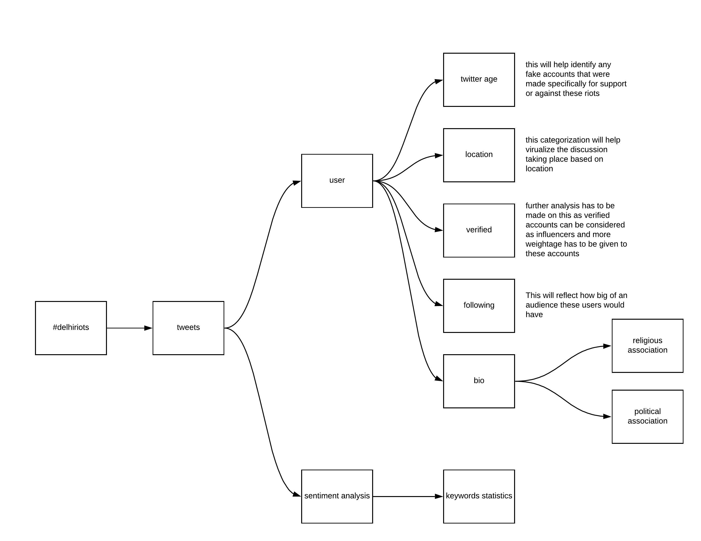
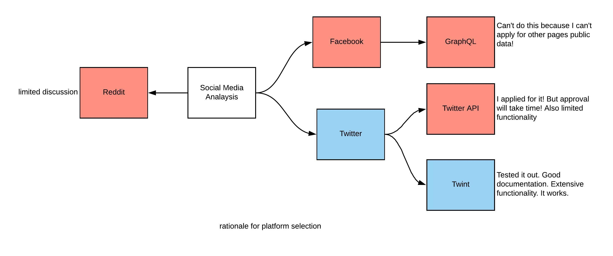

# delhi-riots
Analysis of tweets during delhi riots.

### Objective
To collect data from an API/non static source, store and preprocess it and make preliminary analysis.

### Goal  
Conduct social media analysis for Delhi Riots to conduct sentiment analysis and user profiling.  

### Background  
Following complete [lockdown of Indian-Administered-Kashmir](https://www.aljazeera.com/indepth/inpictures/pictures-100-days-crippling-lockdown-kashmir-191110141155667.html) on August 5, 2019 through abrogation of Article 370 of Indian constitution which gave autonomy to the reagion, government of India, on December 11, 2019, passed a controversial bill called ["Citizenship Amendment Bill"](https://www.bbc.com/news/world-asia-india-50670393), which aimed to provide citizenship to non-muslim minorities through naturalization. These two events were were opposed [nationally](https://edition.cnn.com/2019/12/31/opinions/india-citizenship-law-crosses-line-singh/index.html) and [internationally](https://www.indiatoday.in/india/story/caa-protest-world-students-international-foreign-modi-india-1637241-2020-01-16). Fueling religious radicalization, these events led [riots](https://en.wikipedia.org/wiki/2020_Delhi_riots) in major cities in the country, more specifically Delhi, capital of India. These riots are reffered to as **Delhi Riots**.  

[EU DisinfoLab](https://www.disinfo.eu/), a Brussels based NGO, focused on tackling disinformation campaigns targeting EU, on November 26, 2019 realeased a report titled, ["Uncovered: 265 coordinated fake local media outlets serving Indian interests"](https://www.disinfo.eu/publications/uncovered-265-coordinated-fake-local-media-outlets-serving-indian-interests). This report further raised questions on authenticity of online content and this extends to content on social media. Governments and lobbyists have been using [social media](https://www.nytimes.com/2020/03/29/technology/facebook-google-twitter-november-election.html) to stir public preception.

### Approach  
To achieve above set goal, tweets will be extracted for this particular the [hashtag](https://help.twitter.com/en/using-twitter/how-to-use-hashtags) **#delhiriots**. Unique users will be identified and keyword will be identified. This approch is illustrated in the figure below:  
  

### Data Identification  
#### Platform selection  
Criterion for platform selection are as following:  
- textual rich data
- api/tool for data collection availability  
- amount of disucussion  

In order to conduct this analysis, following social media analysis are considered:  
- facebook
- twitter
- reddit  

For this objective **twitter** is chosen and data is acquired using [twint](https://github.com/twintproject/twint) an opensource library to fetch twitter public data without any limit. Figure below shows rationale behind the decision for platform and tool selection.  
  
#### Tool selection  
Inorder to collect data for this assignment [twint](https://github.com/twintproject/twint) is used. Twint is an advanced twitter scrapping tool which has no limits and no authentication required. The project is 2 years old, however, there is [active participation](https://github.com/twintproject/twint/graphs/code-frequency) by contributors.    

#### data-files  
[dataset on kaggle](https://www.kaggle.com/hamzaafridi/delhi-riots-tweets)  

#### Contact
me@hamzaafridi.com
